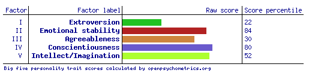
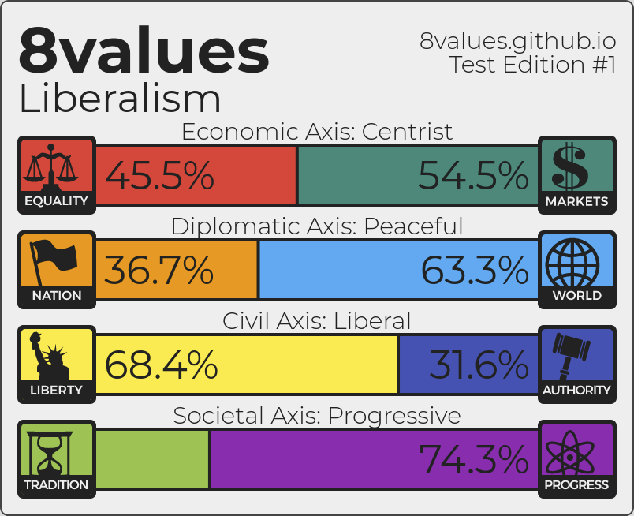
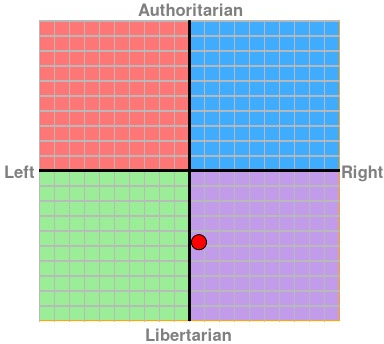
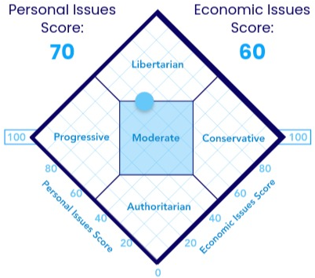

## Personality

1. [I](#1-i)
   1. [What I am](#11-what-i-am)
      1. [_Big 5_](#111-big-5)
      1. [_8values_](#112-8values)
      1. [_The Political Compass_](#113-the-political-compass)
      1. [_The World's Smallest Political Quiz_](#114-the-worlds-smallest-political-quiz)
      1. [_Dichotomy Tests_](#115-dichotomy-tests)
      1. [_Psychology Tools_](#116-psychology-tools)
      1. [_Pew Research Center_](#117-pew-research-center)
   1. [I'm old-fashioned](#12-im-old-fashioned)
1. [In general](#2-in-general)

### 1. I

#### 1.1. What I am

As a **rationalist** and a **cerebral** type, I'm more of a [**mistake theorist**](https://slatestarcodex.com/2018/01/24/conflict-vs-mistake/).
I'm also a [**high-decoupler**](https://unherd.com/2020/02/eugenics-is-possible-is-not-the-same-as-eugenics-is-good/).
(To me, the majority of people seem to be rather **passionate**, **conflict theorists** and/or **low-decouplers**, which often causes misunderstanding.
👉&nbsp;[debating with people](life#4-debates-and-discussing-with-people).)

I have what Thomas Sowell calls [a constrained vision of the world](https://www.city-journal.org/thomas-sowell-race-poverty-culture).

~~I think my [Myers–Briggs personality type](https://en.wikipedia.org/wiki/Myers%E2%80%93Briggs_Type_Indicator) is
[ISTJ (Introversion, Sensing, Thinking, Judgment)](https://en.wikipedia.org/wiki/ISTJ).~~
[Myers-Briggs is discredited](https://80000hours.org/2013/08/why-the-myers-briggs-test-is-not-useful-in-picking-a-career/)
(in favour of Big 5).

##### 1.1.1. _Big 5_

[My results](https://openpsychometrics.org/tests/IPIP-BFFM/results.php?r=2.3,3.8,3.4,4,3.9):

* Extroversion (_surgency_, _positive emotionality_): **2.3** (percentile 22)
* Emotional stability (¬ _neuroticism_, ¬ _negative emotionality_): **3.8** (percentile 84)
* Agreeableness: **3.4** (percentile 30)
* Conscientiousness: **4.0** (percentile 80)
* Intellect/imagination (_openness to experience_): **3.9** (percentile 52)

##### 1.1.2. _8values_

[My results](https://8values.github.io/results.html?e=45.5&d=63.3&g=68.4&s=74.3):

* **&ldquo;Liberalism&rdquo;**
* Economic axis: **centrist**
* Diplomatic axis: **peaceful**
* Civil axis: **liberal**
* Societal axis: **progressive**

##### 1.1.3. _The Political Compass_

[My results](https://www.politicalcompass.org/yourpoliticalcompass?ec=0.63&soc=-4.77):

* Economic left/right: **+0.63**
* Social libertarian/authoritarian: **-4.77**

##### 1.1.4. _The World's Smallest Political Quiz_

[My results](https://www.theadvocates.org/results/centrist?x=70&y=60):

* **&ldquo;Moderate&rdquo;**
* Personal issues score: **70**
* Economic issues score: **60**

##### 1.1.5. _Dichotomy Tests_

[Pending]

* [Political Philosophy](http://dichotomytests.com/test.html?id=5)
* [Philosophy](http://dichotomytests.com/test.html?id=0)
* [Literature](http://dichotomytests.com/test.html?id=3)
* [Economics](http://dichotomytests.com/test.html?id=1)
* [Personality Compass](http://dichotomytests.com/test.html?id=2)

##### 1.1.6. _Psychology Tools_

[Pending]

* [AQ](https://psychology-tools.com/test/autism-spectrum-quotient)
* [EQ](https://psychology-tools.com/test/empathy-quotient)

##### 1.1.7. _Pew Research Center_

[Pending]

https://www.pewresearch.org/politics/quiz/political-typology/

#### 1.2. I'm old-fashioned

I have always been _an old man_.
I was old since I was born.

By that I mean that, compared to my peers, I always tended to be antiquated in my ways and to have unfashionable interests.
Examples:

* Reading:
    - I think a lot about books, newspapers and magazines.
      I read them.
      Often, I even read them _on physical paper_.
      I don't know many (any?) other people my age who buy a newspaper or a magazine at a kiosk from time to time,
      or who is content to pick up an old edition of some book instead of downloading/buying an electronic version.
    - Among those readings, I am most interested in the oldest, less trendy ones.
      For instance, I prefer the classics of world literature and the ancient essays to the latest best-seller and the recent popular novel.
      When I buy a magazine, it's usually _The Economist_ or something of the sort (OK: or something funny like _El Jueves_).
    - I usually join my local library wherever I live (I did it in London, in Madrid, in Tokyo, in Madrid again&hellip;),
      visit it, and sometimes (not much) borrow items.
* Writing:
  I pay a lot of attention to spelling and to good writing.
  Even when I'm _texting_.
  For instance, I never, ever, write things like &ldquo;gonna&rdquo;, or &ldquo;4 you&rdquo;.
  In Spanish, and even when on my cell phone, I never miss an accent, a necessary comma, or an opening inverted question or exclamation mark.
  For me, those details are important.
  Again, I don't even know if I know somebody else who does that.
* Fashion:
  I am very dull and old-fashioned in my dressing.
  This is something I would like to change a bit, in truth.
  But it's been decades already, and I never seem to start caring enough to try to dress like someone in the current age.
  I feel more rejection than most of my peers at the ways teenagers and very young adults dress these days.
* Manners:
  I am rigid in my manners, and expect others to be polite the old way, too.
  I don't like being treated as &ldquo;t&uacute;&rdquo; instead of &ldquo;usted&rdquo; by strangers, shop attendants, and the like.
  I don't like it when passers-by hit you with a question or a comment without prefacing it with a perfunctory &ldquo;hi&rdquo; or &ldquo;excuse me&rdquo;.
  I hate it when people play music out loud from their phones or speakers in public space.

### 2. In general

Although it's a gross simplification, I can usually classify people around me into two groups:

* **Left-brain dominant**: logical; realistic; introverted;  
  calm; dispassionate; facts-oriented;  
  like maths, the sciences and tech
* **Right-brain dominant**: intuitive; idealistic; extroverted;  
  excitable; emotional; feelings-oriented;  
  like language, spirituality and the arts

(Again: this is not scientifically accurate, but a heuristic I tend to apply, almost unconsciously.)

Often, I find it hard to interact with right-brain dominant people.
Conversation is difficult (not to mention debate).
